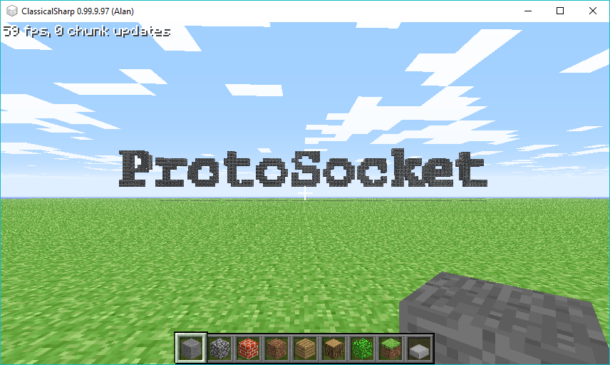

<div align="center">

[](https://raw.githubusercontent.com/alandoherty/protosocket-net/master/LICENSE)
[](https://github.com/alandoherty/protosocket-net/issues)
[](https://github.com/alandoherty/protosocket-net/stargazers)
[](https://github.com/alandoherty/protosocket-net/network)
[](https://www.nuget.org/packages/ProtoSocket/)

</div>

# protosocket

A networking library for frame-based, performant asynchronous TCP sockets on .NET Core. Open permissive MIT license and requires a minimum of .NET Standard 1.3.

## Getting Started

[](https://www.nuget.org/packages/ProtoSocket/)

You can install the package using either the CLI:

```
dotnet add package ProtoSocket
```

or from the NuGet package manager:

```
Install-Package ProtoSocket
```

### Example

You can find two examples inside the project source code. An implementation of a Minecraft Classic server (very basic), and a basic binary chat server.

In the Minecraft example, you can type `/text Moi moi or /texta Moi moi` for 3D text to appear in your world.



## Contributing

Any pull requests or bug reports are welcome, please try and keep to the existing style conventions and comment any additions.