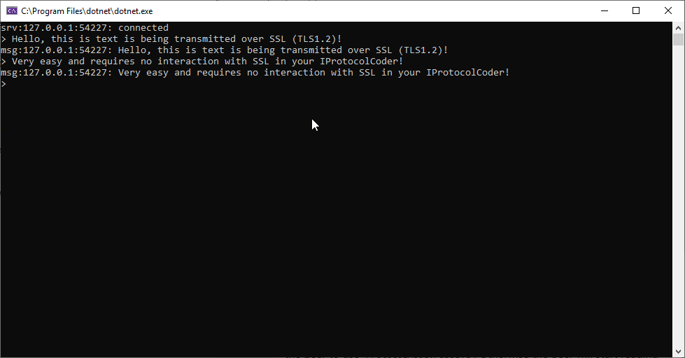

# SSL Example

This example shows how to use SSL to secure your network traffic, this example does not verify that the certificate is signed by a CA but this is trivial to add.

The example also provides a good `IProtocolCoder` implementation which can be extended to support any length-prefixed frame based protocol.

Note that this example is not production ready, it does not perform any clientside validation that the certificate is trusted. Infact is specifically ignores any validation and will accept any certificate, some familiarity with `SslStream` will help translate to using `SslUpgrader` effectively.

### Generating a certificate

The example expects an X509 container named `ssl.p12` in the working directory when running, you can generate a (unsecured) p12 container using the following commands. This container must hold the private key as well as the public key, secured with no password.

```
openssl req -newkey rsa:2048 -nodes -keyout key.pem -x509 -days 365 -out ssl.pem
openssl pkcs12 -inkey key.pem -in ssl.pem -export -out ssl.p12
```

#### Notes

In order to upgrade your `ProtocolPeer`, you will need to explicitly configure the peer to use `ProtocolMode.Passive`. Otherwise the peer will start reading SSL layer frames as soon as the connection has been made, this is intended behaviour when `ProtocolMode.Active` is set but causes issues when you need to handoff negociation to an external library.

## Usage

Once a valid certificate has been generated you can type chat messages to the server, which will print them out.

 